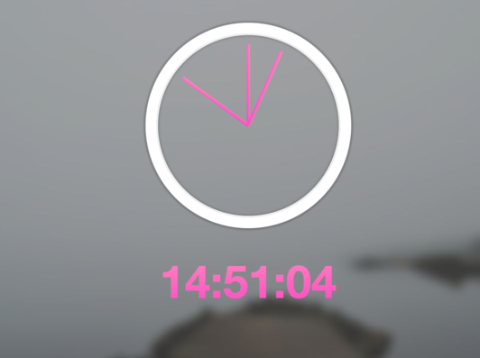

## JS30 - Exercise 2 - JS and CSS Clock

This is a clock I coded whilst following [JS30](http://www.javascript30.com)

In addition to the core functionality implemented via the tutorial, I added several additional elements:

* A time display, by selecting an element id, and using interpolation to print out the time in HH:MM:SS format.

* Added code to add leading zeros by using interpolation and string slice method.

* Added changing gradient background using keyframes and hue-rotate.

to run, clone this repo and open index.html in your browser.